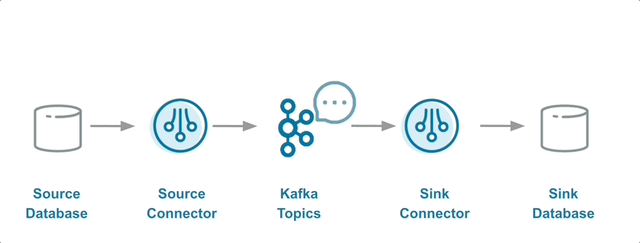
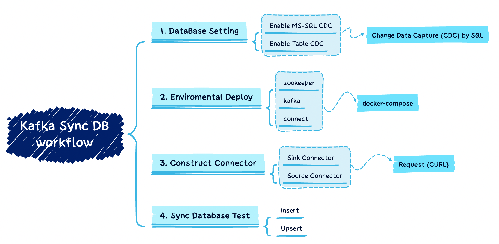

# Use Kafka to sync MS-SQL Database
Kafka Reasearch Project for syncing MS-SQL Database with Kafka.


## Quick Start
```sh
./make.sh
```

## Sync Database with Kafka pipeline


<details>
<summary><strong><em>Workflow</em></strong></summary>

## Workflow

1. use `make_local.sh` to create volume and download the necessray files for connector in the volume on `local` server.
2. use `docker save xxxx > xxxx.tar` to save the images as tar files
3. move the saved tar files to the `RD server`
4. use `docker load -i xxxx.tar` to build image on the `RD server`
5. use `cURL` command to create `source connector` on db
6. `update` or `insert` the source table's row data to trigger the `source connector` to create the target topic
7. use `cURL` command to create `sink connector` on db
8. test the sync result.
 

## Workflow in `./make.sh`
| Step | Operation | Desp |
|-|-|-|
| 1 | Mount the neccessary file of JDBC Connector from volumes. | [Details of dockerfile](./docs/DockerDoc.md#commands-for-download-jdbc-sink-connector) |
| 2 | Create containers by `docker-compose up`. | [Details of dockerfile](./docs/DockerDoc.md) |
| 3 | Create the target topic after building up kafka |
| 4 | Create source and sink connector by http requests. | [Details of connector API ](./docs/ConnectorAPI.md#create-sink-connector) |
</details>

### Docs Guideline
<details>
<summary><strong><em>Guideline Table</em></strong></summary>

| Use | File | Type |
|-|-|-|
| Introduction of Kafka | [docs/KafkaIntroduction.md](./docs/KafkaIntroduction.md) | Kafka |
| Common commands of Kafka| [docs/KafkaShells.md](./docs/KafkaShells.md) | Kafka |
| Topic cleanup | [docs/KafkaCleanup.md](./docs/KafkaCleanup.md) | Kafka |
| Kafka with CAP Theorem | [doc/KafkaWithCAP.md](./docs/KafkaWithCAP.md) | Kafka |
| Optimization of Kafka | [docs/docs/KafkaOptimization.md](./docs/KafkaOptimization.md) | Kafka |
| Dockert setting of Kafka and Connectors | [docs/KafkaDockerDoc.md](./docs/KafkaDockerDoc.md) | Kafka |
| Usecase of Debezium Connector API | [docs/DebeziumConnectorAPI.md](./docs/DebeziumConnectorAPI.md) | Debezium |
| Setting of MSSQL's cdc | [docs/SQLServerSetting.md](./docs/SQLServerSetting.md) | MS-SQL |
| Spike of MSSQL's cdc performance | [docs/SQLCDCPerformance.md](./docs/SQLCDCPerformance.md) | MS-SQL |

</details>


### Experiments
[Record](./docs/experiments/0_sync_speedTest.md) 
