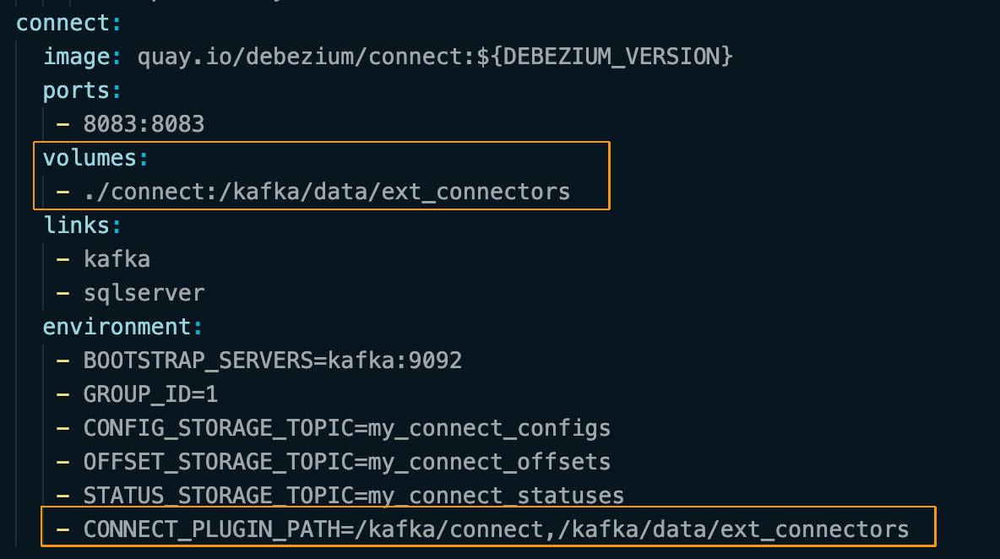
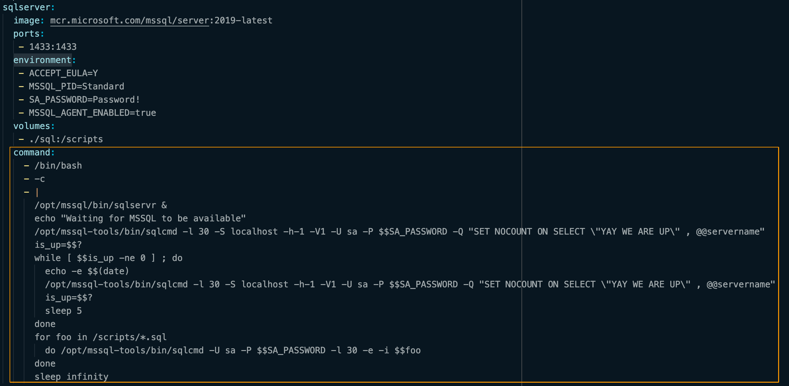

# Docker Setting Document
## Images
### Debezium
> Debezium is an open source distributed platform for change data capture. Debezium is built on top of Apache Kafka and provides Kafka Connect compatible connectors that monitor specific database management systems. 

### kafka
- Kafka image required ***when running the Debezium platform***. 
- We use `quay.io/debezium/zookeeper` as Kafka image in this project.

### zookeeper
> Zookeeper is a mature distributed coordination service that provides distributed configuration services, synchronization services, and named registration capabilities for distributed services. 
- We use `quay.io/debezium/zookeeper` as Kafka Connect image in this project.

### sqlsever
- Only use for **simulation the SQL Server** on the test server
- We use `mcr.microsoft.com/mssql/server:2019-latest` as SQL-Server image.

### connect
> Debezium is used only as a source connector, records all row-level changes. Kafka Connect is a system for moving data into and out of Kafka. All Debezium connectors adhere to the Kafka Connector API for source connectors, and each monitors a specific kind of database management system for changing data, and then forwards those changes directly into Kafka topics organized by server, database, and table. This image defines a runnable Kafka Connect service preconfigured with all Debezium connectors. 
- The service has a `RESTful API` for managing connector instances
    - Start up a container
    - Configure a connector for each data source you want to monitor
    - Let Debezium monitor those sources for changes and forward them to the appropriate Kafka topics.
- [Difference between `Debezium CDC Connector` and `JDBC Connector`](https://stackoverflow.com/questions/60908891/kafka-connect-jdbc-vs-debezium-cdc)
- We use `debezuim/connect` as SQL-Server image.


## Details of `docker-compose.yaml`
### Tags
| tag-name | desp |
|-|-|
| `version` | The version of docker-compose, different versions support different degrees. |
| `links` | ~~Links allow you to define extra aliases by which a service is reachable from another service.~~(have been replaced by `networks`) |
| `environment` | Add environment variables. `-e` |

### How to pass environment variable to docker-compose up?
```sh
{your-environment-variable-name}={your-value} docker compose up
```
```
DEBEZIUM_VERSION=1.9 docker compose up
```

### Work with JDBC Sink Connector
#### Commands for download JDBC Sink connector
- Download Connector
    ```
    curl -LO https://d1i4a15mxbxib1.cloudfront.net/api/plugins/confluentinc/kafka-connect-jdbc/versions/10.5.1/confluentinc-kafka-connect-jdbc-10.5.1.zip
    ```
- Download drive
    ```
    curl -LO https://download.microsoft.com/download/4/d/5/4d5a79be-35f8-48d4-a984-473747362f99/sqljdbc_10.2.1.0_cht.zip
    ```

#### Install JDBC Connector Plugins to the container of `debezium/connect`
- Step 1. Set `volumes` and `environment.CONNECT_PLUGIN_PATH` in `docker-compose.yaml`:
    
    > Volumes are the preferred mechanism for persisting data generated by and used by Docker containers. 
- Step 2. Move `sqljdbc_10.2\\cht/mssql-jdbc-10.2.1.jre11.jar` to `confluentinc-kafka-connect-jdbc-10.5.1/lib/` folder and remove the `jtds-1.3.1.jar` file in `confluentinc-kafka-connect-jdbc-10.5.1/lib/`:
    ```sh
    mv sqljdbc_10.2\\cht/mssql-jdbc-10.2.1.jre11.jar confluentinc-kafka-connect-jdbc-10.5.1/lib/
    rm confluentinc-kafka-connect-jdbc-10.5.1/lib/jtds-1.3.1.jar
    ```
- Step 3. Create the folder of the set volumes path and move the unzip files to the set volumes path, in this case, is `./connect`.
    ```sh 
    mkdir ./connect
    mv confluentinc-kafka-connect-jdbc-10.5.1 connect/    
    ```
- Step 4. Following the above steps, when the container starts, the plugins are installed in the container.

### Auto create test database and enable CDC Setting
- Step 1. Write Sql file for create db and enable cdc of the databases, you can find the explanation of the SQL scripts [here](./SQLServerSetting.md).
- Step 2. Set `volumes` in `docker-compose.yaml`
- Step 3. Overwrite the CMD of Dockerfile by adding a command in docker-compose.yaml, The following script can auto-execute scripts in the sql folder to create a test database and enable cdc on the SQL server.
    

