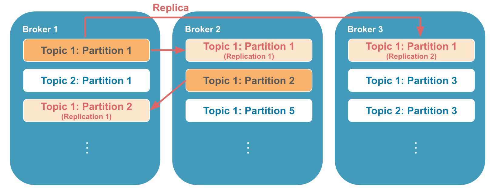
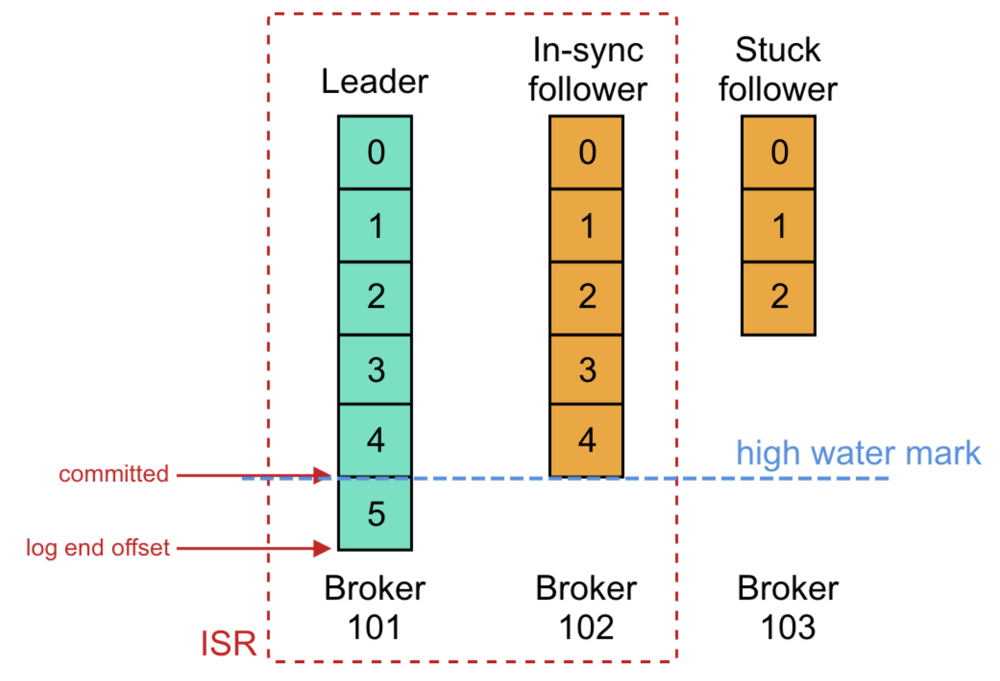

# Kafka Introduction

Apache Kafka is an `Event Streaming Platform` used to collect, process, store, and integrate data at scale. 
- including distributed streaming, stream processing, data integration, and pub/sub messaging.
## Why Companies use Kafka? 
 Kafka allows organizations to modernize their **data strategies with event streaming architecture**.
| Company | Application |
|-|-|
| LINE | Hundreds of billions of messages are produced daily and are used to execute various business logic, threat detection, search indexing and data analysis.  |
| LinkedIn | Apache Kafka is used at LinkedIn for activity stream data and operational metrics. This powers various products like LinkedIn Newsfeed, LinkedIn Today in addition to our offline analytics systems like Hadoop. |
| FireFox | Kafka will soon be replacing part of our current production system to collect performance and usage data from the end-users browser for projects like Telemetry, Test Pilot, etc. Downstream consumers usually persist to either HDFS or HBase. |
| Twitter | [usage case](https://blog.twitter.com/engineering/en_us/a/2015/handling-five-billion-sessions-a-day-in-real-time) |
| Spotify | Kafka is used at Spotify as part of their log delivery system. |
- Due to Kafka's high throughput, fault tolerance, resilience, and scalability, there are numerous use cases across almost every industry 
from banking and fraud detection, to transportation and IoT. We typically see Kafka used for purposes like those below.
- [more...](https://kafka.apache.org/powered-by)

### What's an Event?
An event is any type of action, incident, or change that's identified or recorded by software or applications. 
- For example, a payment, a website click, or a temperature reading, along with a description of what happened.
- An event is a combination of notification—the element of when-ness that can be used to trigger some other activity—and state.
- That state is usually fairly small, say less than a megabyte or so, and is normally represented in some structured format, say in JSON or an object serialized with `Apache Avro™` or `Protocol Buffers`.
- It is also called record or message in the documentation.
- Conceptually, an event has a key, value, timestamp, and optional metadata headers. Here's an example event:

## Kafka & Events (Key/Value Pairs)
- Kafka famously calls the translation between language types and internal bytes serialization and deserialization. 
- The `serialized format` is usually **JSON**, JSON Schema, Avro, or Protobuf.
### Key/Value Pairs

| Name  | Description |
|-|-|
| Keys | Can also be complex domain `objects` but are often primitive types like `strings` or `integers`. |
| Values | Typically the serialized representation of an application domain object or some form of raw message input, like the output of a sensor. |

## Kafka Architecture – Fundamental Concepts

### Producer
Producers are those client applications that **publish (write) events** to Kafka
### Consumer
Consumers are those that **subscribe to (read and process)** these events.

### Topics

- Kafka's most fundamental unit of organization is the `topic`, which is something like a table in a relational database. 
- You create different topics to hold different kinds of events and different topics to hold filtered and transformed versions of the same kind of event.
- A topic is `a log of events`. Logs are easy to understand, because they are simple data structures with well-known semantics. 
    - 1. they are `append only`: When you write a new message into a log, it always goes on the end. 
    - 2. they can only be read by `seeking an arbitrary offset` in the log, then by scanning sequential log entries. 
    - 3. events in the log are `immutable—once` something has happened, **it is exceedingly difficult to make it un-happen**.
- The simple semantics of a log make it feasible for Kafka to deliver high levels of sustained throughput in and out of topics, and also make it easier to reason about the replication of topics, which we'll cover more later.

### Partition

- Kafka is based on the abstraction of a distributed commit log. 
- By splitting a log into partitions, Kafka is able to `scale-out` systems.

### Replication
Replication means having multiple copies of the data, spread across multiple servers/brokers.

- **Leader & Follower** : A leader handles all read and write requests for a partition while the followers passively replicate the leader. Each server acts as a leader for some of its partitions and a follower for others so load is well balanced within the cluster.
#### In-Sync & Out-Sync / Log End Offset & High Watermark

| | Desp |
|-|-|
| In-Sync Replica (ISR) | ISR has the latest data for a given partition. A leader is always an in-sync replica. A follower is an in-sync replica only if it has fully caught up to the partition it's following. |
| Out-Sync Replica（OSR) | Which not ISR. |
| Log End Offset (LEO) | The offset of the last message written to a log. |
| High Watermark (HW) | The High Watermark is the offset of the last message that was successfully copied to all of the log’s in-sync replicas, and is calculated as the minimum LEO across all the ISR of this partition, and it grows monotonically. |

## Reference
| Article | Note |
|-|-|
| [Kafka Official Doc](https://kafka.apache.org/documentation/) | - |
| [What is Apache Kafka?](https://developer.confluent.io/what-is-apache-kafka/) | from confluent |
| [In-depth introduction with some config introduction](https://hevodata.com/learn/kafka-replication)| - |
| [Some Topic, Partitions and keys detailed discussion](https://stackoverflow.com/questions/37511922/topics-partitions-and-keys) | (stackoverflow) |
| [Clear Define of ISR/OSR and HW ]( https://stackoverflow.com/questions/39203215/kafka-difference-between-log-end-offsetleo-vs-high-watermarkhw) | (stackoverflow) |
| [Some partition intorduction with Image](https://zhuanlan.zhihu.com/p/371886710) | (chinese) |
| [Topic, Partition Consumer-group, Replication and Broker introduction with some clear image](https://segmentfault.com/a/1190000040633029) | (chinese) |
