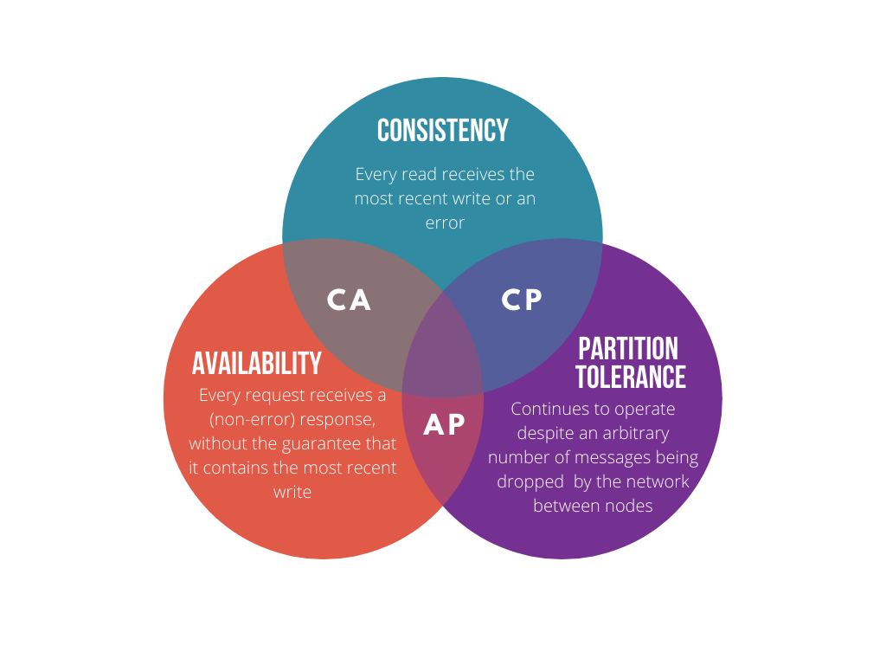

# Kafka in CAP
## CAP Theorem

| concept | desp |
|-|-|
| **Consistency** | Every read receives the **most recent** write or an error. |
| **Availability** | Every request **receives a (non-error) response**, without the guarantee that it contains the most recent write. |
| **Partition Tolerance** | The system **continues to operate** despite an arbitrary number of messages being dropped (or delayed) by the network between nodes. |
## Answer
> All distributed systems must make trade-offs between guaranteeing consistency, availability, and partition tolerance (CAP Theorem). Our goal was to support replication in a Kafka cluster within a single datacenter, where network partitioning is rare, so our design focuses on maintaining highly available and strongly consistent replicas. Strong consistency means that all replicas are byte-to-byte identical, which simplifies the job of an application developer.

## Reference
| Article | Note |
|-|-|
| [Medium article with good-look Image](https://blog.devgenius.io/cap-theorem-distributed-systems-d3ead9ee6342) | - |
| [Greate Discussion about why kafka is not P in CAP Theorem](https://stackoverflow.com/questions/51375187/why-kafka-is-not-p-in-cap-theorem) | - |
| [Wiki of CAP Theorem](https://en.wikipedia.org/wiki/CAP_theorem)| - |
| [Chinese Introduction of CAP](https://zhuanlan.zhihu.com/p/33999708) | (chinese) |
