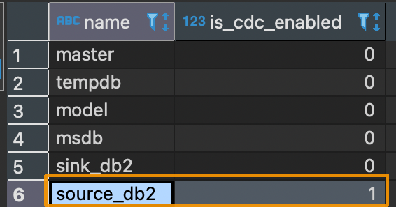
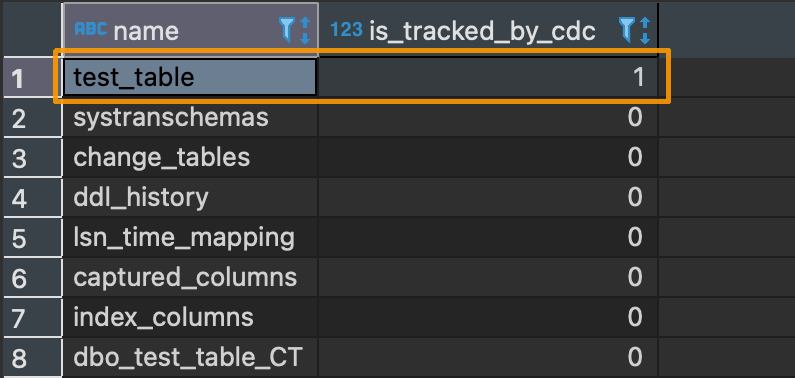

# SQLServer SQLs

## Setting CDC on source DB
```sql
USE <source-db-name>
GO

EXEC sys.sp_cdc_enable_db
GO

EXEC sys.sp_cdc_enable_table
@source_schema = N'dbo',
@source_name = N'test_table',
@role_name = NULL,
@supports_net_changes = 1
GO
```
- Same as scripts in `sql/0_create.sql`.

## Check `Database CDC enabled status`
```sql
SELECT name.is_cdc_enabled FROM sys.databases;
```
### Result


## Check `Table is tracked by cdc`
```sql
SELECT name.is_tracked_by_cdc FROM sys.tables;
```
### Result


##  Create Example SourceDB and SinkDB
```sql
--create where
USE master;  
GO

IF DB_ID (N'sink_db2') IS NULL  
--create sink database 
CREATE DATABASE sink_db2
COLLATE SQL_Latin1_General_CP1_CI_AS  
WITH TRUSTWORTHY ON, DB_CHAINING ON;  
GO

IF DB_ID (N'source_db2') IS NULL  
--create source database 
CREATE DATABASE source_db2  
COLLATE SQL_Latin1_General_CP1_CI_AS  
WITH TRUSTWORTHY ON, DB_CHAINING ON;  
GO

--create table
USE source_db2
GO

CREATE TABLE source_db2.dbo.test_table (
	id int IDENTITY(0,1) NOT NULL,
	[text] varchar(100) COLLATE SQL_Latin1_General_CP1_CI_AS NOT NULL,
	CONSTRAINT test_table_PK PRIMARY KEY (id)
);

```
- Same as scripts in `sql/0_create.sql`.


